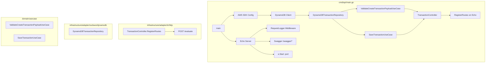

# Design Document: main-go-refactor

## Overview

This design describes the refactored `cmd/api/main.go` for the `ms-transaction-evaluator` microservice. The current `main.go` already follows most hexagonal architecture conventions but contains one inline route handler (the root `/` welcome endpoint) that should be removed. The refactored entrypoint will have exactly three responsibilities:

1. Initialize infrastructure clients (DynamoDB)
2. Wire dependencies manually (repositories → use cases → controllers)
3. Start the Echo server with controller-registered routes and Swagger docs

The refactoring is minimal — the current code is close to the target state. The primary changes are removing the root `/` handler and confirming the existing structure meets all requirements.

## Architecture

The entrypoint follows the hexagonal architecture pattern already established in the project:



The dependency flow is strictly one-directional: `main.go` → adapters → use cases → domain. No dependency points inward from domain to infrastructure.

## Components and Interfaces

### main.go Responsibilities (Post-Refactor)

The `main()` function performs these steps in order:

1. Load `.env` via `godotenv.Load()`
2. Load AWS SDK config with region from `AWS_REGION` env var (default: `us-east-1`)
3. Create `*dynamodb.Client` — with custom endpoint if `DYNAMO_DB_ENDPOINT` is set, default otherwise
4. Instantiate `DynamoDBTransactionRepository` with the client and `DYNAMO_DB_TRANSACTIONS_TABLE`
5. Instantiate `ValidateCreateTransactionPayloadUseCase`
6. Instantiate `SaveTransactionUseCase` with the repository
7. Instantiate `TransactionController` with both use cases
8. Create `echo.New()` and apply `middleware.RequestLogger()`
9. Call `transactionController.RegisterRoutes(e)`
10. Register Swagger at `GET /swagger/*`
11. Read `EVALUATOR_APP_PORT` and call `e.Start()`

### Controller Interface

Each controller exposes a `RegisterRoutes` method:

```go
func (tc *TransactionController) RegisterRoutes(e *echo.Echo)
```

This is the contract between `main.go` and controllers. The entrypoint calls `RegisterRoutes` and never defines inline handlers for application endpoints.

### Existing Components (Unchanged)

| Component | Package | Role |
|---|---|---|
| `TransactionController` | `infrastructure/adapter/in/http` | Inbound HTTP adapter, registers `POST /evaluate` |
| `DynamoDBTransactionRepository` | `infrastructure/adapter/out/aws/dynamodb` | Outbound persistence adapter |
| `SaveTransactionUseCase` | `domain/usecase` | Orchestrates transaction persistence |
| `ValidateCreateTransactionPayloadUseCase` | `domain/usecase` | Validates request payloads |
| `TransactionRepository` | `domain/repository` | Port interface for persistence |

### What Changes

| Change | Before | After |
|---|---|---|
| Root `/` route | `e.GET("/", func(...) { ... })` with "Hello, World!" | Removed entirely |
| Inline handlers | One inline handler for `/` | Zero inline handlers for application endpoints |

Everything else in `main.go` remains as-is — the DynamoDB initialization, dependency wiring, controller registration, Swagger route, and server startup are already correct.

## Data Models

### Environment Variables

| Variable | Required | Default | Purpose |
|---|---|---|---|
| `AWS_REGION` | No | `us-east-1` | AWS SDK region configuration |
| `DYNAMO_DB_ENDPOINT` | No | (none) | Custom DynamoDB endpoint for local dev |
| `DYNAMO_DB_TRANSACTIONS_TABLE` | Yes | (none) | DynamoDB table name |
| `EVALUATOR_APP_PORT` | Yes | (none) | HTTP server listen port |

### Dependency Graph (Instantiation Order)

```
dynamodb.Client
  └─► DynamoDBTransactionRepository
        └─► SaveTransactionUseCase
              └─► TransactionController
ValidateCreateTransactionPayloadUseCase ─┘
```

### Domain Types (Existing, Unchanged)

- `entity.EvaluateTransactionRequest` — inbound request payload
- `entity.TransactionEntity` — persisted transaction record
- `entity.Currency` — enum: USD, COP, EUR
- `entity.PaymentMethod` — enum: CARD, BANK_TRANSFER, CRYPTO
- `repository.TransactionRepository` — port interface with `Save(ctx, *TransactionEntity) error`
