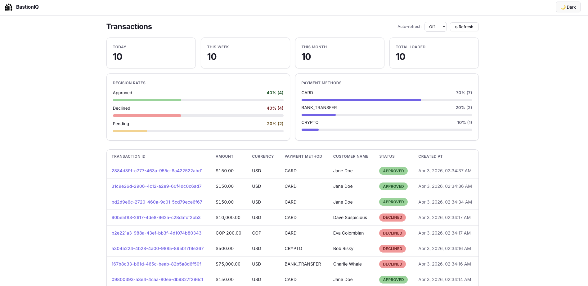
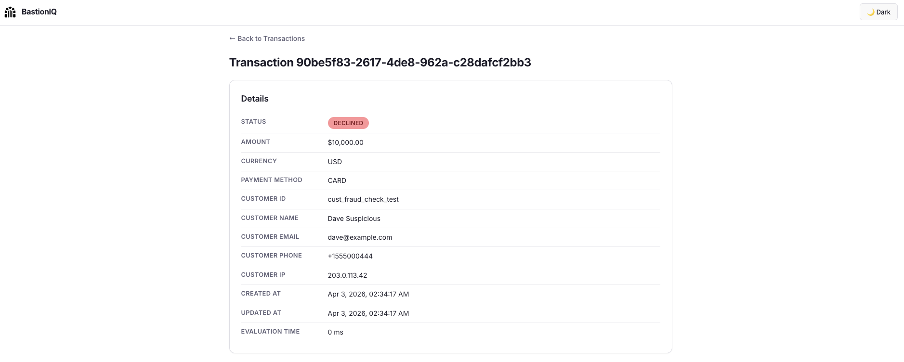
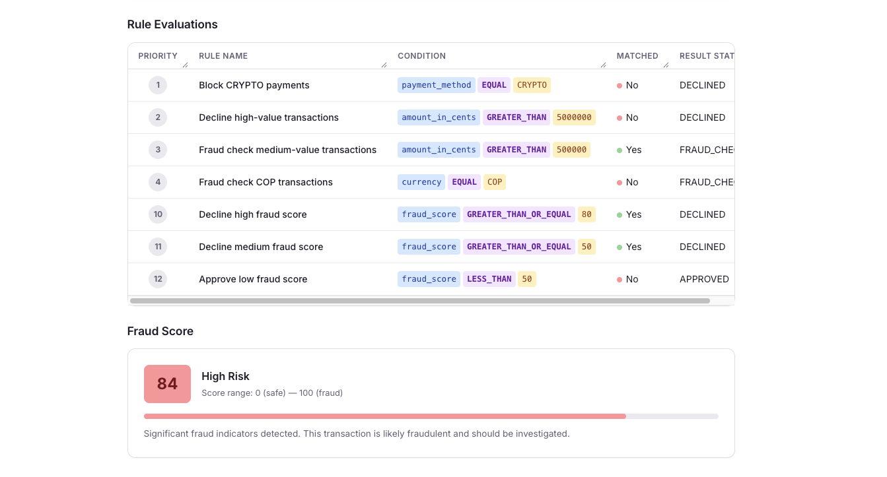

# 🛡️ Fraud Detection Engine

A backend system for evaluating financial transactions and detecting potential fraud in real time. Built as a microservices architecture using event-driven communication through Apache Kafka, with DynamoDB for persistence and Redis for caching.

---

## Table of Contents

- [Overview](#overview)
- [Architecture](#architecture)
- [Data Flow](#data-flow)
- [Services](#services)
  - [Transaction Evaluator](#transaction-evaluator-ms-transaction-evaluator)
  - [Decision Service](#decision-service-ms-decision-service)
  - [Fraud Score Service](#fraud-score-service-ms-fraud-score)
  - [BastionIQ Dashboard](#bastioniq-dashboard-dashboard)
- [Infrastructure](#infrastructure)
- [Kafka Topics](#kafka-topics)
- [DynamoDB Tables](#dynamodb-tables)
- [Rules Engine](#rules-engine)
- [Observability](#observability)
- [Getting Started](#getting-started)
- [Testing Scenarios](#testing-scenarios)
- [Development](#development)
- [Tech Stack](#tech-stack)
- [Project Structure](#project-structure)
- [License](#license)

---

## Overview

The Fraud Detection Engine processes financial transactions through a pipeline that validates, persists, evaluates against configurable rules, and optionally computes a fraud score using fuzzy logic. The system produces a final decision for each transaction: `APPROVED`, `DECLINED`, or routed through `FRAUD_CHECK` for deeper analysis.

The engine follows a fail-open design — if no rule matches a transaction, it is approved by default.

---

## Architecture

The system follows Hexagonal Architecture (Ports & Adapters) across all services, ensuring clean separation between domain logic and infrastructure concerns. Services communicate asynchronously via Kafka topics.

```
┌─────────────────────────────────────────────────────────────────────────────┐
│                          Fraud Detection Engine                             │
│                                                                             │
│  ┌──────────────────────┐    Kafka     ┌──────────────────────┐             │
│  │  Transaction         │──────────────│  Decision            │             │
│  │  Evaluator           │  Transaction │  Service             │             │
│  │  (Go / Echo)         │  .Created    │  (Go / Sarama)       │             │
│  │                      │              │                      │             │
│  │  REST API (:3000)    │              │  Rules Engine        │             │
│  │  DynamoDB (txns)     │◄─────────────│  DynamoDB (rules)    │             │
│  │  Kafka Producer      │  Decision    │  Kafka Consumer/     │             │
│  └──────────────────────┘  .Calculated │  Producer            │             │
│                                        └──────────┬───────────┘             │
│                                                    │                        │
│                                          FraudScore│.Request                │
│                                                    │                        │
│                                        ┌───────────▼──────────┐             │
│                                        │  Fraud Score         │             │
│                                        │  Service             │             │
│                                        │  (Python / FastAPI)  │             │
│                                        │                      │             │
│                                        │  Fuzzy Logic Scorer  │             │
│                                        │  Redis (cache)       │             │
│                                        │  DynamoDB (scores)   │             │
│                                        │  Kafka Consumer/     │             │
│                                        │  Producer            │             │
│                                        └──────────────────────┘             │
│                                                                             │
│  Infrastructure: DynamoDB Local | Kafka + Zookeeper | Redis | Kafka UI      │
└─────────────────────────────────────────────────────────────────────────────┘
```

---

## Data Flow

A transaction goes through the following pipeline:

1. A client sends a `POST /evaluate` request to the Transaction Evaluator with transaction details (amount, currency, payment method, customer info).

2. The Transaction Evaluator validates the payload, persists the transaction to DynamoDB with status `PENDING`, and publishes a `Transaction.Created` event to Kafka.

3. The Decision Service consumes the event and evaluates the transaction against active rules sorted by priority:
   - If a rule matches with `APPROVED` or `DECLINED`, the result is published to `Decision.Calculated`.
   - If a rule matches with `FRAUD_CHECK`, the transaction is forwarded to `FraudScore.Request` for deeper analysis.
   - If no rule matches, the transaction is approved (fail-open).

4. The Fraud Score Service consumes `FraudScore.Request`, computes a fraud score (0–100) using a fuzzy inference system, caches the result in Redis, persists it to DynamoDB, and publishes the score to `FraudScore.Calculated`.

5. The Decision Service consumes `FraudScore.Calculated`, evaluates the fraud score against fraud-score-specific rules, and publishes the final decision to `Decision.Calculated`.

6. The Transaction Evaluator consumes `Decision.Calculated` and updates the transaction status in DynamoDB to `APPROVED` or `DECLINED`.

---

## Services

### Transaction Evaluator (`ms-transaction-evaluator`)

The entry point of the system. Exposes a REST API for submitting transactions and manages the transaction lifecycle.

| Property | Value |
|---|---|
| Language | Go 1.25+ |
| Framework | Echo v5 |
| Port | 3000 |
| Database | DynamoDB (`ddb-transactions`) |

Responsibilities:
- Validate incoming transaction payloads (amount, currency, payment method, customer info)
- Persist transactions to DynamoDB
- Publish `Transaction.Created` events to Kafka
- Consume `Decision.Calculated` events and update transaction status
- Serve Swagger/OpenAPI documentation at `/swagger/*`

Supported values:
- Currencies: `USD`, `COP`, `EUR`
- Payment methods: `CARD`, `BANK_TRANSFER`, `CRYPTO`

API endpoint:

```
POST /evaluate
Content-Type: application/json

{
  "amount_in_cents": 15000,
  "currency": "USD",
  "payment_method": "CARD",
  "customer": {
    "customer_id": "cust_123",
    "name": "John Doe",
    "email": "john@example.com",
    "phone": "+1234567890",
    "ip_address": "192.168.1.1"
  }
}
```

### Decision Service (`ms-decision-service`)

The rules engine of the system. Evaluates transactions against configurable rules stored in DynamoDB and orchestrates the fraud score check flow.

| Property | Value |
|---|---|
| Language | Go 1.25+ |
| Port | 3001 |
| Database | DynamoDB (`ddb-rules`) |

Responsibilities:
- Consume `Transaction.Created` events
- Evaluate transactions against active rules sorted by priority
- Publish decisions to `Decision.Calculated` or route to `FraudScore.Request`
- Consume `FraudScore.Calculated` events and apply fraud-score rules for a final decision

Rule evaluation supports these condition fields:
- `amount_in_cents` (numeric comparison)
- `currency` (string equality)
- `payment_method` (string equality)
- `customer_id` (string equality)
- `customer_ip_address` (string equality)
- `fraud_score` (numeric comparison)

Operators: `GREATER_THAN`, `LESS_THAN`, `EQUAL`, `NOT_EQUAL`, `GREATER_THAN_OR_EQUAL`, `LESS_THAN_OR_EQUAL`

### Fraud Score Service (`ms-fraud-score`)

Computes fraud scores using a fuzzy logic inference system. This is the only Python service in the system.

| Property | Value |
|---|---|
| Language | Python 3.12 |
| Framework | FastAPI |
| Port | 3002 |
| Database | DynamoDB (`ddb-fraud-scores`) |
| Cache | Redis |

Responsibilities:
- Consume `FraudScore.Request` events from Kafka
- Compute a fraud score (0–100) using fuzzy logic based on:
  - Transaction amount (0–1,000,000 cents)
  - Payment method risk (BANK_TRANSFER=1, CARD=3, CRYPTO=8)
  - IP address risk (hash-based heuristic, 0–10)
- Cache scores in Redis
- Persist scores to DynamoDB
- Publish results to `FraudScore.Calculated`

The fuzzy inference system uses trapezoidal and triangular membership functions with 7 inference rules to classify transactions into low, medium, and high fraud risk categories.

### BastionIQ Dashboard (`dashboard`)

A read-only Single Page Application that gives fraud analysts a unified view of transactions, rule evaluations, and fraud scores across all three microservices.

| Property | Value |
|---|---|
| Language | TypeScript |
| Framework | React 18 + Vite |
| Port | 5173 |

Responsibilities:
- Display paginated transaction list with status badges and currency formatting
- Show dashboard analytics: transaction volume (day/week/month), approval and decline rates, payment method distribution
- Transaction detail view with all fields, rule evaluation results (with color-coded conditions), and detailed fraud score analysis
- Dark mode toggle with localStorage persistence
- Manual refresh and configurable auto-refresh (10s, 30s, 1min, 5min)
- Graceful error handling with retry buttons for each microservice

#### Screenshots

**Dashboard home — analytics overview and transaction list**



**Transaction detail — customer information and transaction fields**



**Transaction detail — rule evaluations and fraud score analysis**



---

## Infrastructure

All infrastructure runs locally via Docker Compose.

| Service | Image | Port | Purpose |
|---|---|---|---|
| DynamoDB Local | `amazon/dynamodb-local` | 8000 | NoSQL database (in-memory, shared DB mode) |
| Zookeeper | `confluentinc/cp-zookeeper:7.5.0` | 2181 | Kafka coordination |
| Kafka | `confluentinc/cp-kafka:7.5.0` | 9092 | Event streaming |
| Kafka UI | `provectuslabs/kafka-ui` | 8080 | Kafka topic browser and monitoring |
| Redis | `redis:7-alpine` | 6379 | Fraud score caching |
| BastionIQ Dashboard | `node:20 + nginx` | 5173 | Fraud analyst dashboard SPA |
| Grafana | `grafana/grafana:11.6.0` | 3003 | Observability dashboards |
| Loki + Promtail | `grafana/loki:3.5.0` | 3100 | Log aggregation |
| Tempo | `grafana/tempo:2.7.2` | 3200 | Distributed tracing |
| Prometheus | `prom/prometheus:v3.4.1` | 9090 | Metrics storage |
| OTel Collector | `otel/opentelemetry-collector-contrib:0.127.0` | 4317 | Telemetry pipeline |
| Kafka Exporter | `danielqsj/kafka-exporter:v1.9.0` | 9308 | Kafka metrics exporter |

---

## Kafka Topics

| Topic | Producer | Consumer | Payload |
|---|---|---|---|
| `Transaction.Created` | Transaction Evaluator | Decision Service | Full transaction entity |
| `Decision.Calculated` | Decision Service | Transaction Evaluator | `{ transaction_id, status }` |
| `FraudScore.Request` | Decision Service | Fraud Score Service | Transaction attributes for scoring |
| `FraudScore.Calculated` | Fraud Score Service | Decision Service | `{ transaction_id, fraud_score, calculated_at }` |

---

## DynamoDB Tables

| Table | Partition Key | Sort Key | Service |
|---|---|---|---|
| `ddb-transactions` | `id` (String) | — | Transaction Evaluator |
| `ddb-rules` | `rule_id` (String) | — | Decision Service |
| `ddb-rule-evaluations` | `transaction_id` (String) | `rule_id` (String) | Decision Service |
| `ddb-fraud-scores` | `transaction_id` (String) | — | Fraud Score Service |

---

## Rules Engine

Rules are stored in DynamoDB and evaluated in priority order (lowest number = highest priority). The seed data includes:

| Priority | Rule | Condition | Decision |
|---|---|---|---|
| 1 | Block CRYPTO payments | `payment_method == CRYPTO` | DECLINED |
| 2 | Decline high-value | `amount > $50,000` | DECLINED |
| 3 | Fraud check medium-value | `amount > $5,000` | FRAUD_CHECK |
| 4 | Fraud check COP currency | `currency == COP` | FRAUD_CHECK |
| 10 | Decline high fraud score | `fraud_score >= 80` | DECLINED |
| 11 | Decline medium fraud score | `fraud_score >= 50` | DECLINED |
| 12 | Approve low fraud score | `fraud_score < 50` | APPROVED |

---

## Observability

The system includes a full Grafana-based observability stack that starts alongside all other services. Everything is pre-configured — no manual setup required.

### Stack

| Service | Image | Port | Purpose |
|---|---|---|---|
| Grafana | `grafana/grafana:11.6.0` | 3003 | Visualization UI — dashboards for logs, traces, metrics |
| Loki | `grafana/loki:3.5.0` | 3100 | Log aggregation backend |
| Promtail | `grafana/promtail:3.5.0` | — | Collects Docker container logs and pushes to Loki |
| Tempo | `grafana/tempo:2.7.2` | 3200 | Distributed tracing backend |
| OTel Collector | `otel/opentelemetry-collector-contrib:0.127.0` | 4317/4318 | Receives OTLP traces/metrics, forwards to Tempo and Prometheus |
| Prometheus | `prom/prometheus:v3.4.1` | 9090 | Metrics scraping and storage |
| Kafka Exporter | `danielqsj/kafka-exporter:v1.9.0` | 9308 | Exposes Kafka broker/topic/consumer-group metrics |

### Dashboards

Grafana is accessible at [http://localhost:3003](http://localhost:3003) (anonymous access, no login required) with six pre-provisioned dashboards:

| Dashboard | Datasource | What it shows |
|---|---|---|
| Logs | Loki | Structured logs from all containers, filterable by container and log level |
| Traces | Tempo | Distributed traces across microservices |
| Request Metrics | Prometheus | HTTP request rate, latency (avg/p95), and error rate per service |
| Kafka | Prometheus | Message throughput per topic, consumer group lag, partition offsets |
| Container Resources | Prometheus | CPU, memory, and network I/O per Docker container (via cAdvisor) |
| Transaction Evaluation | Tempo + Prometheus | End-to-end pipeline traces and duration histogram (p50/p95/p99) |

### Instrumentation

Both Go microservices are instrumented with OpenTelemetry:

- HTTP tracing and metrics via Echo OTel middleware
- Kafka produce/consume spans via otelsarama
- DynamoDB spans via AWS SDK OTel instrumentation
- Prometheus `/metrics` endpoint for scraping
- Trace context propagation through HTTP headers and Kafka message headers

Logs from all containers are collected automatically by Promtail (no application code changes needed).

### Configuration

All observability config files live under `observability/`:

```
observability/
├── grafana/
│   ├── grafana.ini                          # Anonymous auth, port 3000
│   ├── provisioning/
│   │   ├── datasources/datasources.yml      # Loki, Tempo, Prometheus
│   │   └── dashboards/dashboards.yml        # Auto-load dashboard JSONs
│   └── dashboards/                          # Pre-built dashboard JSON files
├── loki/loki-config.yml
├── tempo/tempo-config.yml
├── otel-collector/otel-collector-config.yml
├── prometheus/prometheus.yml
└── promtail/promtail-config.yml
```

Configurable ports via `.env`:

| Variable | Default | Service |
|---|---|---|
| `GRAFANA_PORT` | 3003 | Grafana |

---

## 🚀 Getting Started

### Prerequisites

- Docker and Docker Compose
- Go 1.25+ (for local development of Go services)
- Python 3.12+ (for local development of the fraud score service)
- AWS CLI (used via Docker for DynamoDB operations)

### Full Setup (recommended)

From the project root, run the one-command setup that builds all services, waits for infrastructure readiness, creates DynamoDB tables, seeds data, and creates Kafka topics:

```bash
make setup
```

This runs the following steps in order:
1. `start` — Builds and starts all Docker containers
2. `wait-for-infra` — Waits for DynamoDB and Kafka to be healthy
3. `create-transactions-table` — Creates the transactions table
4. `create-rules-table` — Creates the rules table
5. `create-fraud-scores-table` — Creates the fraud scores table
6. `seed` — Seeds rules, sample transactions, and fraud scores
7. `create-topics` — Creates all Kafka topics

### Manual Infrastructure Start

```bash
# Start infrastructure only
docker compose up -d

# Create tables individually
make create-transactions-table
make create-rules-table
make create-fraud-scores-table

# Seed data
make seed

# Create Kafka topics
make create-topics
```

---

## Testing Scenarios

The project includes shell scripts to test the three main decision paths:

### Approved Transaction
A small USD CARD payment ($150) — no rule matches, fail-open to APPROVED.
```bash
make test-approved
```

### Declined Transaction
A CRYPTO payment triggers rule-001 (Block CRYPTO → DECLINED). Also tests a high-value bank transfer ($75,000) that triggers rule-002.
```bash
make test-declined
```

### Fraud Check Transaction
A $10,000 USD CARD payment triggers rule-003 (Amount > $5,000 → FRAUD_CHECK). Also tests a COP currency transaction that triggers rule-004.
```bash
make test-fraud-check
```

---

## 🔧 Development

### Running Services Locally

Each service can be run independently for development:

```bash
# Transaction Evaluator (Go)
cd ms-transaction-evaluator
make run          # Standard run
make run-dev      # Hot-reload with Air

# Decision Service (Go)
cd ms-decision-service
make run          # Standard run
make run-dev      # Hot-reload with Air

# Fraud Score Service (Python)
cd ms-fraud-score
make install      # Install dependencies
make run          # Run with uvicorn (hot-reload)
```

### Running Tests

```bash
# Transaction Evaluator
cd ms-transaction-evaluator && make test

# Decision Service
cd ms-decision-service && make test

# Fraud Score Service
cd ms-fraud-score && make test

# Dashboard
cd dashboard && npm test
```

### Linting

Both Go services use golangci-lint v2 with ~50 linters enabled:

```bash
cd ms-transaction-evaluator && make lint
cd ms-decision-service && make lint
```

The Python service uses ruff:

```bash
cd ms-fraud-score && make lint
```

### Useful Commands

```bash
# List all transactions in DynamoDB
cd ms-transaction-evaluator && make list-records

# Get a specific transaction
cd ms-transaction-evaluator && make get-transaction ID=<transaction-id>

# List all rules
cd ms-decision-service && make list-rules

# List all fraud scores
cd ms-fraud-score && make list-scores
```

---

## Tech Stack

| Component | Technology |
|---|---|
| Transaction Evaluator | Go 1.25, Echo v5, AWS SDK v2, Sarama (Kafka), zerolog |
| Decision Service | Go 1.25, Sarama (Kafka), AWS SDK v2, zerolog |
| Fraud Score Service | Python 3.12, FastAPI, confluent-kafka, scikit-fuzzy, Redis, boto3 |
| BastionIQ Dashboard | TypeScript, React 18, Vite, React Router v6 |
| Message Broker | Apache Kafka 7.5.0 (Confluent) + Zookeeper |
| Database | Amazon DynamoDB Local |
| Cache | Redis 7 (Alpine) |
| API Docs | Swagger/OpenAPI (swag + echo-swagger) |
| Containerization | Docker + Docker Compose |
| Observability | Grafana, Loki, Tempo, Prometheus, OpenTelemetry, cAdvisor |
| Hot Reload | Air (Go), uvicorn --reload (Python) |
| Linting | golangci-lint v2 (Go), ruff (Python) |
| Testing | Go standard `testing` package, pytest + Hypothesis (Python) |

---

## Project Structure

```
.
├── docker-compose.yml              # All infrastructure and services
├── Makefile                        # Root-level setup, seeding, and test commands
├── .env                            # Shared environment variables
├── scripts/
│   ├── seed-dynamo.sh              # Seeds DynamoDB tables with rules and sample data
│   ├── test-approved.sh            # Test script for approved transaction flow
│   ├── test-declined.sh            # Test script for declined transaction flow
│   └── test-fraud-check.sh         # Test script for fraud check flow
│
├── ms-transaction-evaluator/       # Transaction Evaluator (Go)
│   ├── cmd/api/main.go             # Entrypoint — wires dependencies, starts Echo server
│   ├── internal/
│   │   ├── domain/
│   │   │   ├── entity/             # Domain models (Transaction, Currency, PaymentMethod)
│   │   │   ├── repository/         # Port interfaces
│   │   │   └── usecase/            # Business logic (validate, save, update status)
│   │   └── infrastructure/
│   │       └── adapter/
│   │           ├── in/http/        # REST controller (Echo)
│   │           ├── in/kafka/       # Decision.Calculated consumer
│   │           └── out/            # DynamoDB repository, Kafka publisher
│   ├── docs/                       # Swagger generated docs
│   └── Makefile
│
├── ms-decision-service/            # Decision Service (Go)
│   ├── cmd/service/main.go         # Entrypoint — wires Kafka consumers/producers
│   ├── internal/
│   │   ├── domain/
│   │   │   ├── entity/             # Rules, decisions, transaction messages
│   │   │   ├── repository/         # Port interfaces
│   │   │   └── usecase/            # Rule evaluation, fraud score evaluation
│   │   └── infrastructure/
│   │       └── adapter/
│   │           ├── in/kafka/       # Transaction and FraudScore consumers
│   │           └── out/            # DynamoDB rule repo, Kafka publishers
│   └── Makefile
│
├── ms-fraud-score/                 # Fraud Score Service (Python)
│   ├── app/
│   │   ├── main.py                 # FastAPI entrypoint with Kafka consumer lifecycle
│   │   ├── config.py               # Environment configuration
│   │   ├── domain/
│   │   │   ├── entity/             # FraudScoreRequest, FraudScoreResult
│   │   │   ├── port/               # Port interfaces (cache, publisher, store)
│   │   │   ├── service/            # Fuzzy logic scorer
│   │   │   └── usecase/            # Compute fraud score orchestration
│   │   └── infrastructure/
│   │       └── adapter/
│   │           ├── inbound/        # Kafka consumer
│   │           └── outbound/       # Redis cache, DynamoDB store, Kafka publisher
│   ├── requirements.txt
│   └── Makefile
│
├── dashboard/                      # BastionIQ Dashboard (React + TypeScript)
│   ├── src/
│   │   ├── api/                    # API client modules (transactions, evaluations, scores)
│   │   ├── components/             # Shared UI (StatusBadge, ScoreIndicator, ErrorBanner, DashboardStats)
│   │   ├── hooks/                  # Custom hooks (useTheme)
│   │   ├── pages/                  # TransactionList, TransactionDetail
│   │   ├── utils/                  # Formatters (currency, date, evaluation time)
│   │   ├── App.tsx                 # Router + layout + navbar
│   │   └── main.tsx                # Entry point
│   ├── public/icons/logo.svg       # BastionIQ logo
│   ├── Dockerfile                  # Multi-stage: node build → nginx serve
│   ├── package.json
│   └── vite.config.ts
│
├── observability/                  # Grafana observability stack configs
│   ├── grafana/
│   │   ├── grafana.ini             # Grafana server config (anonymous auth)
│   │   ├── provisioning/           # Datasource and dashboard provisioning
│   │   └── dashboards/             # Pre-built Grafana dashboard JSON files
│   ├── loki/loki-config.yml
│   ├── tempo/tempo-config.yml
│   ├── otel-collector/otel-collector-config.yml
│   ├── prometheus/prometheus.yml
│   └── promtail/promtail-config.yml
│
└── docs/
    ├── images/                     # Dashboard screenshots
    └── fraud_detection_engine.drawio
│
└── docs/
    └── fraud_detection_engine.drawio
```

---

## License

See [LICENSE](LICENSE) for details.
